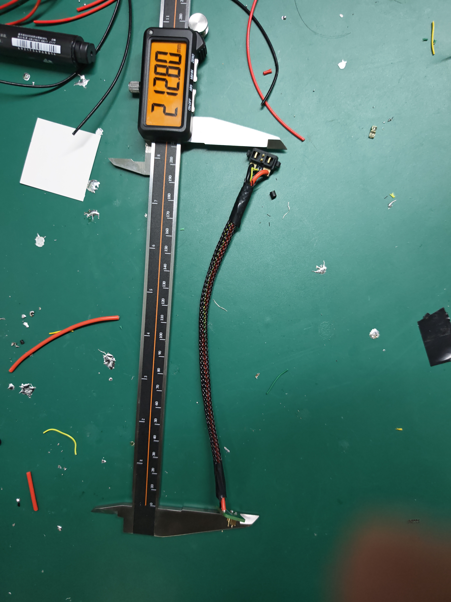
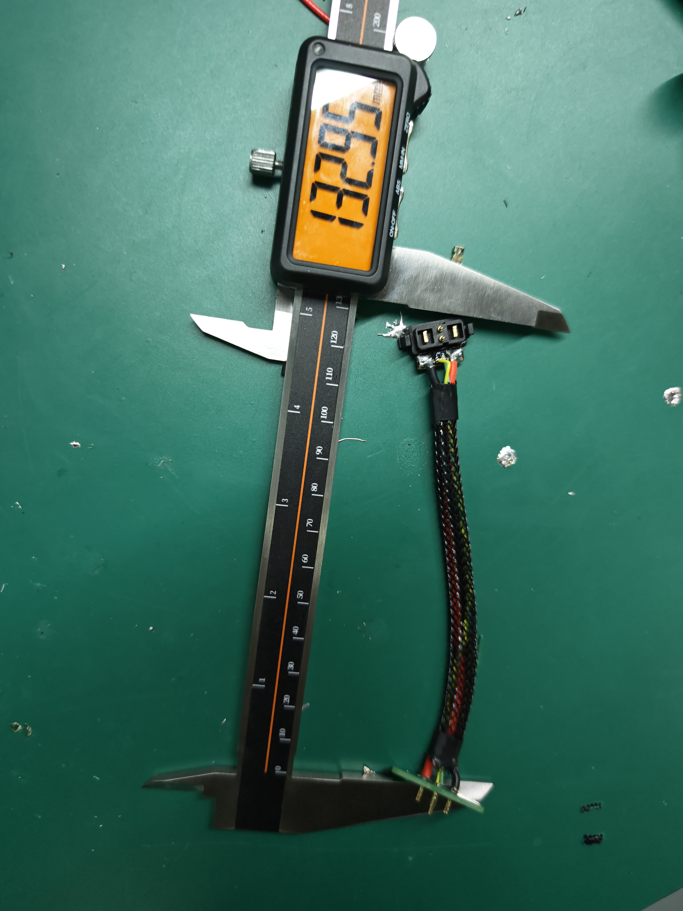
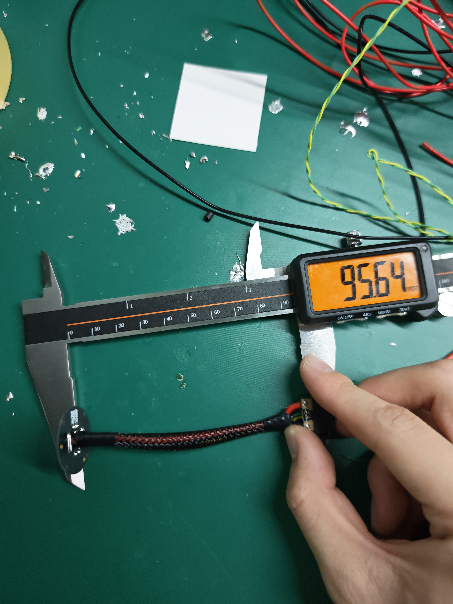
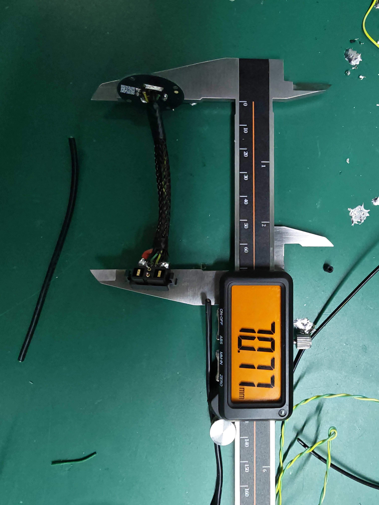
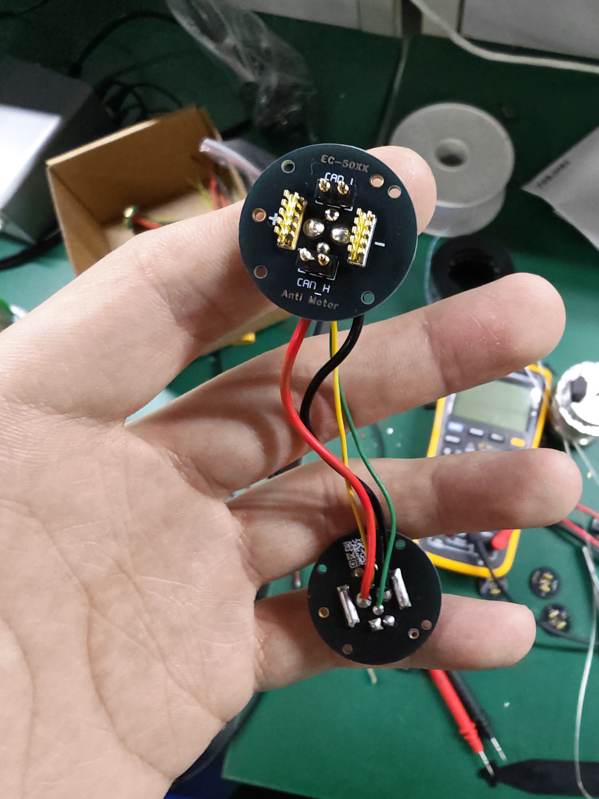
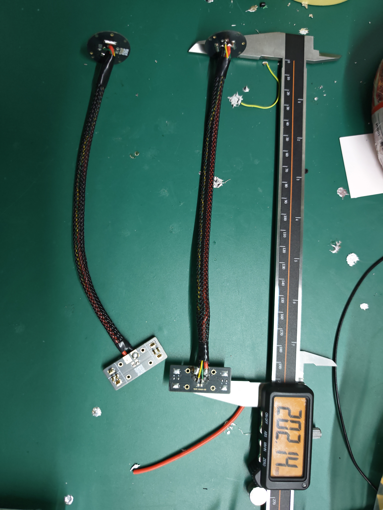
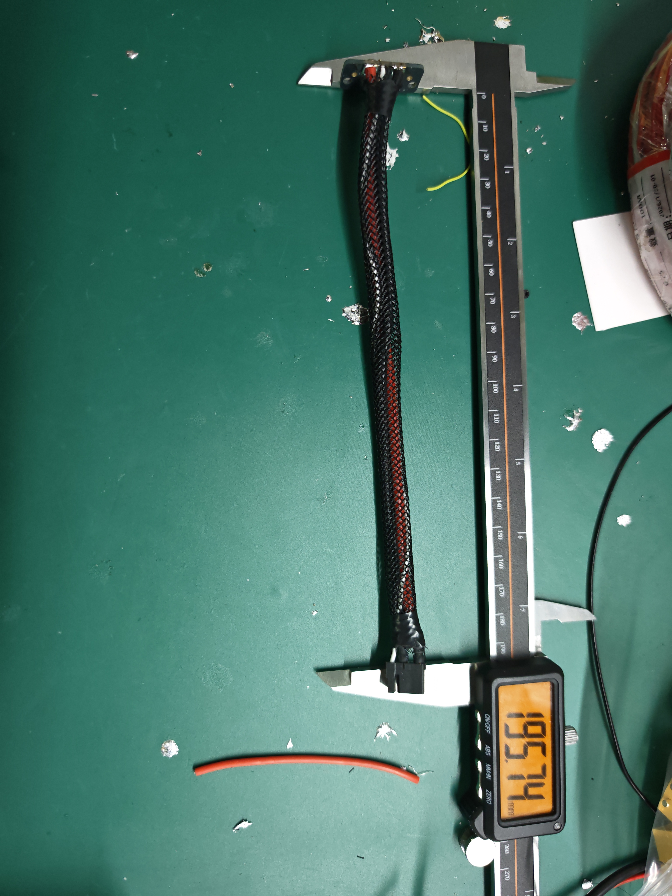
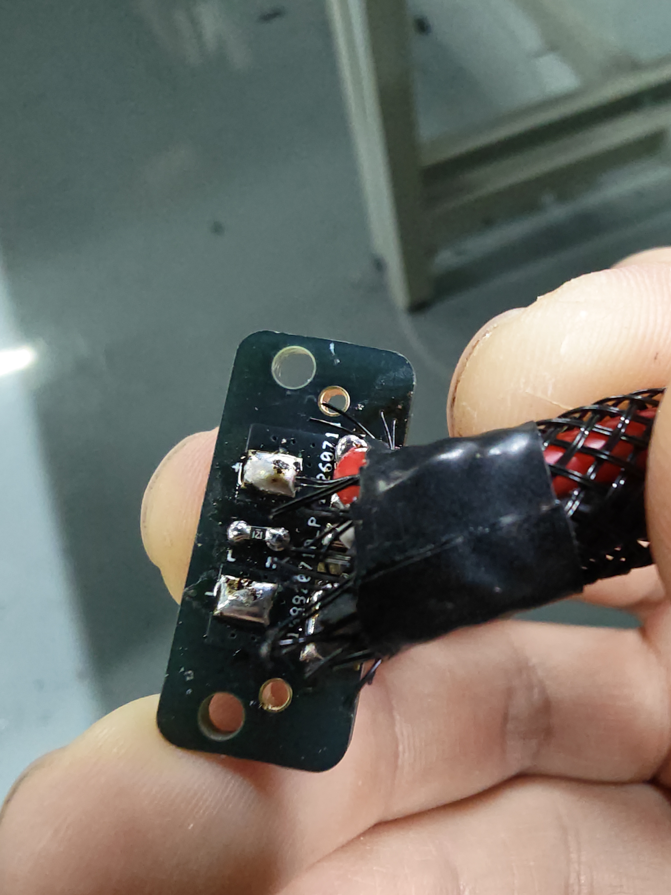

# EC-H130 线长

## 大腿

- 电源：200 mm。
- 信号：250 mm。

## 小臂

- 电源线：130 mm。

## 腿根

- 电路板：72xx。
- 线长：095 mm。

## 臂根

- 电路板：50xx。
- 线长：70 mm。

## 腿直角件 ×2

- 电路板：72xx。
- 线长：95 mm。

## 小腿双尾部

- 电源：200 mm。
- 信号线：203 mm。
- 需 120 Ω 电阻。

## 腰

- 线长：200 mm。
- 需 120 Ω 电阻。

## 左肩、右肩

- 线长：100 mm。
- 需 120 Ω 电阻。
